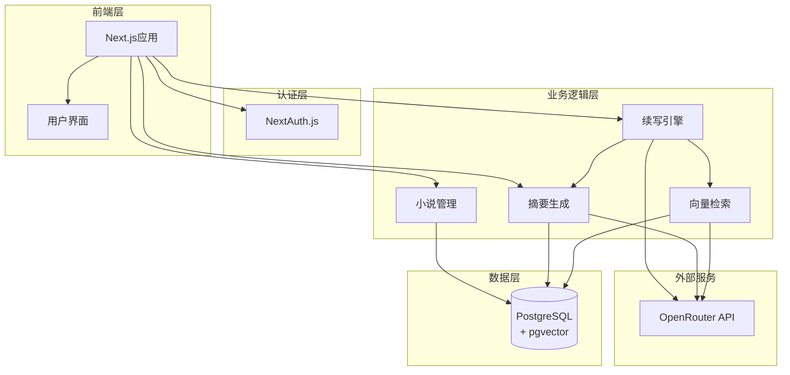

# AI小说续写系统实现计划

## 系统架构概览

## 数据模型设计

基于需求，核心数据模型包括：

- **User**: 用户账户，存储API key
- **Novel**: 小说基本信息
- **Chapter**: 章节内容、摘要
- **Summary**: 三级摘要（章节/卷/全局）
- **Embedding**: 向量化存储（使用pgvector）
- **NovelMetadata**: 关键信息（人物、地点、设定）
- **Continuation**: 续写记录

## 实现步骤

### 阶段1：基础设施搭建

#### 步骤1.1：PostgreSQL + pgvector环境搭建

**目标**：使用docker-compose部署PostgreSQL数据库，启用pgvector扩展**可验证成果**：

- docker-compose.yml文件配置完成
- 数据库容器成功启动
- pgvector扩展已安装并可用
- 可以通过psql连接数据库

**文件**：

- `docker-compose.yml` - PostgreSQL配置
- `.env.example` - 环境变量模板

#### 步骤1.2：项目依赖安装与配置

**目标**：安装所有必要的npm包，配置开发工具**可验证成果**：

- 所有依赖安装完成（Prisma、NextAuth.js、OpenRouter客户端等）
- Vitest配置完成，可以运行测试
- TypeScript配置优化完成

**文件**：

- `package.json` - 更新依赖
- `vitest.config.ts` - Vitest配置
- `.env.local` - 本地环境变量

### 阶段2：数据库设计与ORM配置

#### 步骤2.1：Prisma Schema设计

**目标**：设计完整的数据库模式，支持用户、小说、章节、摘要、向量存储等**可验证成果**：

- `prisma/schema.prisma`文件创建
- 所有模型定义完整（User、Novel、Chapter、Summary、Embedding、NovelMetadata、Continuation）
- pgvector类型正确配置
- 关系定义正确

**文件**：

- `prisma/schema.prisma` - 数据库模式定义

#### 步骤2.2：数据库迁移与初始化

**目标**：生成迁移文件，执行数据库迁移**可验证成果**：

- 迁移文件生成成功
- 数据库表结构创建完成
- 可以通过Prisma Studio查看表结构

**文件**：

- `prisma/migrations/` - 迁移文件

#### 步骤2.3：Prisma Client工具函数

**目标**：创建数据库操作的辅助函数和类型定义**可验证成果**：

- `lib/prisma.ts` - Prisma Client单例
- 基础CRUD操作的测试用例通过

**文件**：

- `lib/prisma.ts` - Prisma Client
- `lib/db/` - 数据库操作函数
- `tests/db/` - 数据库操作测试

### 阶段3：用户认证系统

#### 步骤3.1：NextAuth.js配置

**目标**：配置NextAuth.js，支持用户名/密码认证**可验证成果**：

- NextAuth配置完成
- 可以注册新用户
- 可以登录现有用户
- Session管理正常工作

**文件**：

- `auth.ts` - NextAuth配置
- `app/api/auth/[...nextauth]/route.ts` - 认证路由
- `tests/auth/` - 认证测试

#### 步骤3.2：用户管理界面

**目标**：创建登录、注册页面**可验证成果**：

- 登录页面可用
- 注册页面可用
- 用户可以成功注册和登录
- 登录后可以访问受保护的路由

**文件**：

- `app/login/page.tsx` - 登录页面
- `app/register/page.tsx` - 注册页面
- `components/auth/` - 认证相关组件

### 阶段4：OpenRouter API集成

#### 步骤4.1：OpenRouter客户端封装

**目标**：创建OpenRouter API客户端，支持获取模型列表、调用大模型和embedding模型**可验证成果**：

- 可以获取可用模型列表
- 可以调用大模型进行文本生成
- 可以调用embedding模型生成向量
- 错误处理完善

**文件**：

- `lib/openrouter/client.ts` - OpenRouter客户端
- `lib/openrouter/types.ts` - API类型定义
- `tests/openrouter/` - OpenRouter测试

#### 步骤4.2：用户API Key管理

**目标**：实现用户API key的存储和管理功能**可验证成果**：

- 用户可以在设置中配置API key
- API key加密存储
- 用户可以使用自己的API key调用OpenRouter

**文件**：

- `app/api/user/api-key/route.ts` - API key管理API
- `app/settings/page.tsx` - 设置页面
- `tests/api-key/` - API key管理测试

### 阶段5：小说上传与解析

#### 步骤5.1：文件上传功能

**目标**：实现txt文件上传，存储到数据库**可验证成果**：

- 用户可以上传txt文件
- 文件内容正确存储到Novel和Chapter表
- 文件大小和格式验证

**文件**：

- `app/api/novels/upload/route.ts` - 上传API
- `app/novels/upload/page.tsx` - 上传页面
- `tests/upload/` - 上传功能测试

#### 步骤5.2：章节识别功能

**目标**：使用LLM自动识别章节边界**可验证成果**：

- LLM可以正确识别章节标题和分界
- 章节索引正确
- 章节内容正确分割

**文件**：

- `lib/novel/chapter-parser.ts` - 章节解析逻辑
- `tests/chapter-parser/` - 章节解析测试

### 阶段6：向量化存储

#### 步骤6.1：Embedding生成与存储

**目标**：为章节内容生成embedding并存储到pgvector**可验证成果**：

- 可以为章节生成embedding
- embedding正确存储到数据库
- 支持批量生成embedding

**文件**：

- `lib/embeddings/generator.ts` - Embedding生成
- `lib/embeddings/store.ts` - 向量存储
- `tests/embeddings/` - Embedding测试

#### 步骤6.2：向量检索功能

**目标**：实现基于相似度的章节检索**可验证成果**：

- 可以根据查询文本检索相关章节
- 支持相关性阈值过滤
- 返回结果按相关性排序

**文件**：

- `lib/embeddings/search.ts` - 向量检索
- `tests/embeddings/search.test.ts` - 检索测试

### 阶段7：摘要提取功能

#### 步骤7.1：章节摘要生成

**目标**：为单个章节生成摘要**可验证成果**：

- 可以为章节生成结构化摘要
- 摘要包含核心事件、人物活动、关键信息
- 支持超长章节的分段处理

**文件**：

- `lib/summary/chapter-summary.ts` - 章节摘要生成
- `app/api/novels/[novelId]/summaries/chapters/[chapterId]/route.ts` - API
- `tests/summary/chapter.test.ts` - 章节摘要测试

#### 步骤7.2：关键信息提取

**目标**：提取并维护人物、地点、世界观等关键信息**可验证成果**：

- 可以提取人物信息及关系
- 可以提取地点信息
- 可以提取世界观设定
- 关键信息正确存储到NovelMetadata

**文件**：

- `lib/summary/metadata-extractor.ts` - 关键信息提取
- `tests/summary/metadata.test.ts` - 元数据提取测试

#### 步骤7.3：全局摘要生成

**目标**：实现全局摘要的生成和更新（参考docs/summary_strategy.md）**可验证成果**：

- 可以生成全局摘要（核心剧情、人物关系、世界观）
- 支持手动触发更新
- 支持增量更新策略
- 全局摘要包含最近N章的滑动窗口

**文件**：

- `lib/summary/global-summary.ts` - 全局摘要生成
- `app/api/novels/[novelId]/summaries/global/update/route.ts` - API
- `tests/summary/global.test.ts` - 全局摘要测试

### 阶段8：续写功能实现

#### 步骤8.1：摘要方案续写

**目标**：实现基于摘要的续写功能**可验证成果**：

- 可以获取全局摘要和最近章节摘要
- 可以组装续写上下文
- 可以调用LLM进行续写
- 续写结果符合要求

**文件**：

- `lib/continuation/summary-strategy.ts` - 摘要策略
- `app/api/novels/[novelId]/continue/route.ts` - 续写API
- `tests/continuation/summary.test.ts` - 摘要方案测试

#### 步骤8.2：RAG方案续写

**目标**：实现基于向量检索的续写功能**可验证成果**：

- 可以根据用户提示词检索相关章节
- 支持相关性阈值动态提取章节
- 可以结合检索结果进行续写

**文件**：

- `lib/continuation/rag-strategy.ts` - RAG策略
- `tests/continuation/rag.test.ts` - RAG方案测试

#### 步骤8.3：混合方案续写

**目标**：实现RAG+摘要+关键信息的混合续写**可验证成果**：

- 可以组合RAG检索、摘要和关键信息
- Token分配合理，不超过上下文限制
- 续写质量优于单一方案

**文件**：

- `lib/continuation/hybrid-strategy.ts` - 混合策略
- `tests/continuation/hybrid.test.ts` - 混合方案测试

#### 步骤8.4：续写结果管理

**目标**：实现续写结果的保存（追加或创建新版本）**可验证成果**：

- 用户可以选择追加或创建新版本
- 续写结果正确保存
- 续写历史可以查看

**文件**：

- `lib/continuation/save.ts` - 续写保存逻辑
- `app/api/novels/[novelId]/continue/save/route.ts` - 保存API
- `tests/continuation/save.test.ts` - 保存功能测试

### 阶段9：用户界面开发

#### 步骤9.1：小说管理界面

**目标**：创建小说列表、详情、上传等页面**可验证成果**：

- 可以查看小说列表
- 可以查看小说详情和章节
- 可以上传新小说
- UI美观现代（使用Tailwind）

**文件**：

- `app/novels/page.tsx` - 小说列表
- `app/novels/[novelId]/page.tsx` - 小说详情
- `components/novel/` - 小说相关组件

#### 步骤9.2：续写界面

**目标**：创建续写操作界面，支持选择策略和输入提示词**可验证成果**：

- 可以选择续写策略（RAG/摘要/混合）
- 可以输入提示词
- 可以查看续写结果
- 可以选择保存方式（追加/新版本）

**文件**：

- `app/novels/[novelId]/continue/page.tsx` - 续写页面
- `components/continuation/` - 续写相关组件

#### 步骤9.3：摘要管理界面

**目标**：创建摘要查看和更新界面**可验证成果**：

- 可以查看章节摘要和全局摘要
- 可以手动触发全局摘要更新
- 摘要内容展示清晰

**文件**：

- `app/novels/[novelId]/summaries/page.tsx` - 摘要页面
- `components/summary/` - 摘要相关组件

## 技术栈清单

### 已安装

- Next.js 16.1.0
- React 19.2.3
- Tailwind CSS 4
- TypeScript 5

### 需要安装

- Prisma (@prisma/client, prisma)
- NextAuth.js (next-auth)
- pgvector (通过PostgreSQL扩展)
- OpenRouter客户端 (openai兼容客户端或直接使用fetch)
- Vitest (vitest, @vitest/ui)
- Zod (数据验证)
- bcryptjs (密码加密)

## 开发原则

1. **TDD开发**：每个功能先写测试，再实现代码
2. **类型安全**：充分利用TypeScript，避免使用any
3. **错误处理**：完善的错误处理和用户提示
4. **代码组织**：清晰的目录结构，职责分离
5. **可测试性**：函数式设计，便于单元测试

## 关键决策点

1. **章节分块策略**：按章节分块，如章节过长则进一步分段
2. **向量化粒度**：每个章节生成一个embedding向量
3. **摘要更新**：全局摘要手动触发，章节摘要自动生成