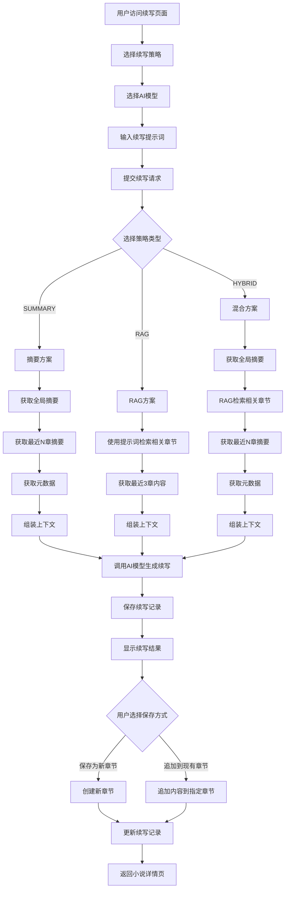

# 小说续写流程说明

## 概述

本项目提供三种续写策略：**摘要方案(SUMMARY)**、**RAG方案(RAG)** 和 **混合方案(HYBRID)**。用户可以根据需求选择合适的策略进行小说续写。

## 整体流程图



## 详细流程说明

### 1. 用户界面层

**文件位置**: [`app/novels/[novelId]/continue/page.tsx`](app/novels/[novelId]/continue/page.tsx)

用户在续写页面可以：
- 选择续写策略（SUMMARY/RAG/HYBRID）
- 选择AI模型（从OpenRouter获取可用模型列表）
- 输入续写提示词
- 查看续写结果
- 选择保存方式（新章节或追加到现有章节）

### 2. API层

**文件位置**: [`app/api/novels/[novelId]/continue/route.ts`](app/api/novels/[novelId]/continue/route.ts)

API端点负责：
- 验证用户身份和权限
- 验证小说所有权
- 获取用户的OpenRouter API Key
- 调用续写业务逻辑
- 保存续写记录到数据库
- 返回续写结果

### 3. 续写策略层

**文件位置**: [`lib/continuation/index.ts`](lib/continuation/index.ts)

统一入口函数 [`continueNovel()`](lib/continuation/index.ts:22) 根据策略类型分发到不同的实现。

---

## 三种续写策略详解

### 策略一：摘要方案 (SUMMARY)

**文件位置**: [`lib/continuation/summary-strategy.ts`](lib/continuation/summary-strategy.ts)

**适用场景**: 适合需要了解整体剧情走向的续写，上下文较轻量。

**执行流程**:
1. 获取全局摘要（`Summary.type = GLOBAL`）
2. 获取最近N章的摘要（默认5章，可配置）
3. 获取小说元数据（人物、世界观等）
4. 组装上下文信息
5. 构建续写提示词
6. 调用AI模型生成续写

**上下文组成**:
```
全局摘要
---
最近章节摘要
---
人物信息
---
世界观设定
```

**参数配置**:
- `recentCount`: 最近章节数量（默认5，范围1-20）

---

### 策略二：RAG方案 (RAG)

**文件位置**: [`lib/continuation/rag-strategy.ts`](lib/continuation/rag-strategy.ts)

**适用场景**: 适合需要参考特定情节或场景的续写，基于语义相似度检索相关章节。

**执行流程**:
1. 使用用户提示词进行向量检索，找到相关章节
2. 获取最近3章内容（了解当前剧情位置）
3. 组装上下文信息
4. 构建续写提示词
5. 调用AI模型生成续写

**上下文组成**:
```
相关章节内容（基于向量检索）
---
最近章节内容
```

**参数配置**:
- `similarityThreshold`: 相似度阈值（默认0.7，范围0-1）
- `maxRAGChapters`: 最大检索章节数（默认10，范围1-20）

**检索机制**:
- 使用 [`searchSimilarChaptersByThreshold()`](lib/embeddings/search.ts) 函数
- 基于OpenAI text-embedding-3-small模型生成向量
- 使用pgvector进行相似度搜索

---

### 策略三：混合方案 (HYBRID) ⭐推荐

**文件位置**: [`lib/continuation/hybrid-strategy.ts`](lib/continuation/hybrid-strategy.ts)

**适用场景**: 综合利用全局剧情、相关章节和关键信息，适合大多数续写场景。

**执行流程**:
1. 获取全局摘要（压缩版，只取核心剧情）
2. 使用RAG检索相关章节
3. 获取最近N章的摘要
4. 获取小说元数据（人物、世界观等）
5. 组装上下文信息（控制各部分长度）
6. 构建续写提示词
7. 调用AI模型生成续写

**上下文组成**:
```
全局摘要（核心剧情）
---
相关章节内容（RAG检索）
---
最近章节摘要
---
主要人物
---
世界观设定
```

**参数配置**:
- `similarityThreshold`: 相似度阈值（默认0.7）
- `maxRAGChapters`: 最大RAG检索章节数（默认5）
- `recentCount`: 最近章节数量（默认3）

**长度控制**:
- 全局摘要：取核心剧情部分（约500字）
- RAG章节：每章节限制1500字符
- 最近章节摘要：每章限制300字符
- 主要人物：只取前5个

---

## 保存续写结果

### API端点

**文件位置**: [`app/api/novels/[novelId]/continue/save/route.ts`](app/api/novels/[novelId]/continue/save/route.ts)

### 业务逻辑

**文件位置**: [`lib/continuation/save.ts`](lib/continuation/save.ts)

### 保存方式

#### 1. 保存为新章节 (NEW_VERSION)

- 自动获取当前最大章节索引
- 创建新章节，索引为 `最大索引 + 1`
- 章节标题格式：`续写章节 {索引}`
- 更新续写记录的 `saveType` 和 `chapterId`

#### 2. 追加到现有章节 (APPEND)

- 需要指定章节ID
- 将续写内容追加到指定章节的末尾
- 更新章节字数统计
- 更新续写记录的 `saveType` 和 `chapterId`

---

## 数据模型

### Continuation 模型

**文件位置**: [`prisma/schema.prisma`](prisma/schema.prisma:180-198)

```prisma
model Continuation {
  id          String              @id @default(uuid())
  novelId     String
  strategy    ContinuationStrategy // RAG, SUMMARY, HYBRID
  prompt      String              @db.Text
  context     Json?
  result      String              @db.Text
  saveType    ContinuationSaveType?
  chapterId   String?
  createdAt   DateTime            @default(now())
  novel       Novel               @relation(...)
}
```

### 枚举类型

```prisma
enum ContinuationStrategy {
  RAG     // RAG方案
  SUMMARY // 摘要方案
  HYBRID  // 混合方案
}

enum ContinuationSaveType {
  APPEND      // 追加到现有章节
  NEW_VERSION // 创建新版本
}
```

---

## AI模型调用

### OpenRouter客户端

**文件位置**: [`lib/openrouter/client.ts`](lib/openrouter/client.ts)

使用 [`createOpenRouterClient()`](lib/openrouter/client.ts) 创建客户端，调用 [`chatCompletion()`](lib/openrouter/client.ts) 方法。

### 通用参数

- `temperature`: 0.7（控制创造性）
- `max_tokens`: 4000（最大输出长度）
- `model`: 用户选择的模型或用户默认模型

---

## 前置条件

续写功能需要以下前置数据：

1. **用户配置**:
   - 用户已配置OpenRouter API Key
   - 用户已设置默认模型（可选）

2. **小说数据**:
   - 小说已上传并解析完成
   - 章节已正确识别和存储

3. **摘要数据**（SUMMARY和HYBRID策略需要）:
   - 全局摘要已生成
   - 章节摘要已生成

4. **向量数据**（RAG和HYBRID策略需要）:
   - 章节内容的向量嵌入已生成
   - Embedding表中已存储向量数据

5. **元数据**（SUMMARY和HYBRID策略需要）:
   - NovelMetadata中已提取人物、世界观等信息

---

## 错误处理

续写过程中可能遇到的错误：

1. **认证错误**: 用户未登录或无权限
2. **配置错误**: 用户未配置API Key
3. **数据错误**: 小说不存在或摘要/向量数据缺失
4. **API错误**: OpenRouter API调用失败
5. **验证错误**: 输入参数不符合要求

---

## 示例请求

```json
POST /api/novels/{novelId}/continue
{
  "prompt": "主角遇到了新的挑战，需要做出艰难的选择",
  "strategy": "HYBRID",
  "model": "openai/gpt-4o",
  "recentCount": 3,
  "similarityThreshold": 0.7,
  "maxRAGChapters": 5
}
```

```json
POST /api/novels/{novelId}/continue/save
{
  "continuationId": "xxx-xxx-xxx",
  "saveType": "NEW_VERSION",
  "chapterId": null
}
```

---

## 策略选择建议

| 策略 | 适用场景 | 优点 | 缺点 |
|------|----------|------|------|
| SUMMARY | 需要了解整体剧情走向 | 上下文轻量，响应快 | 可能遗漏细节 |
| RAG | 需要参考特定情节 | 精准定位相关内容 | 可能忽略全局剧情 |
| HYBRID | 大多数场景 | 综合全面，平衡性好 | 上下文较大，稍慢 |
