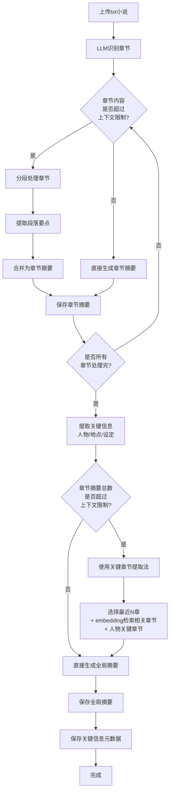
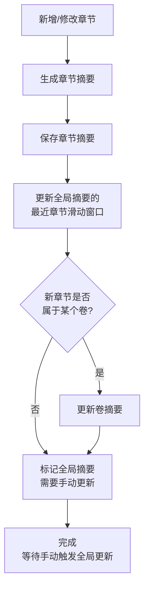
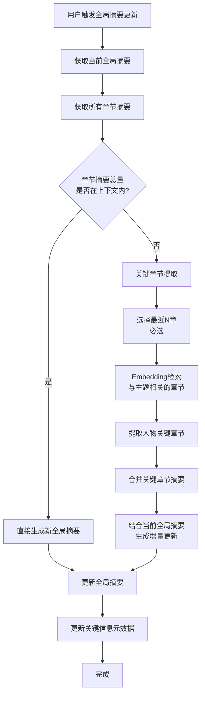
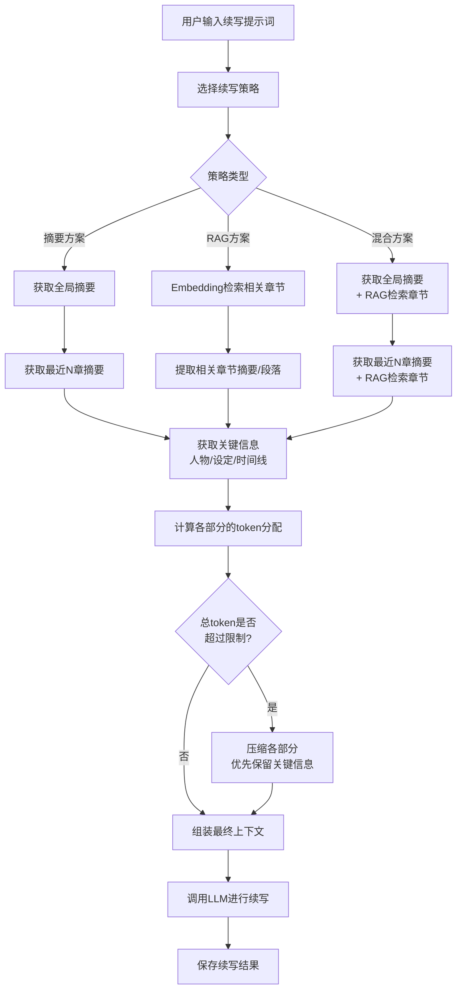
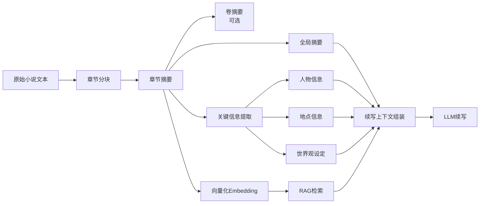
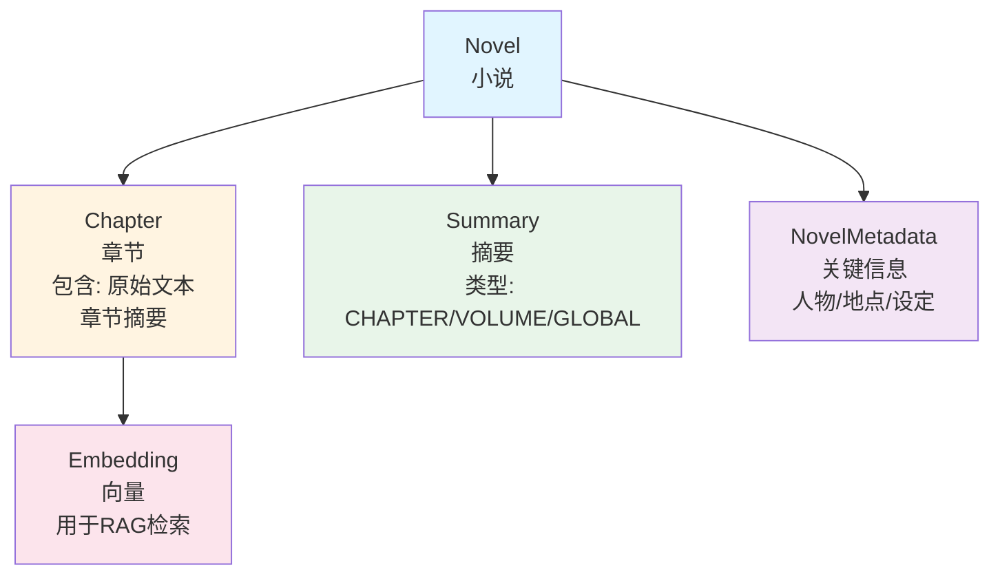
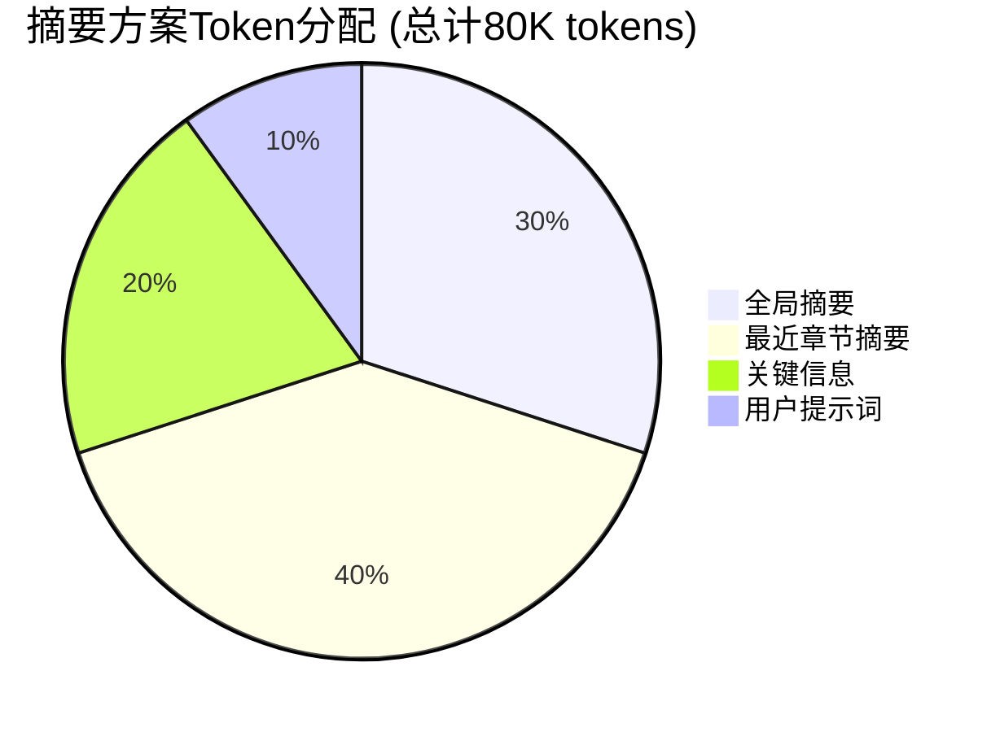
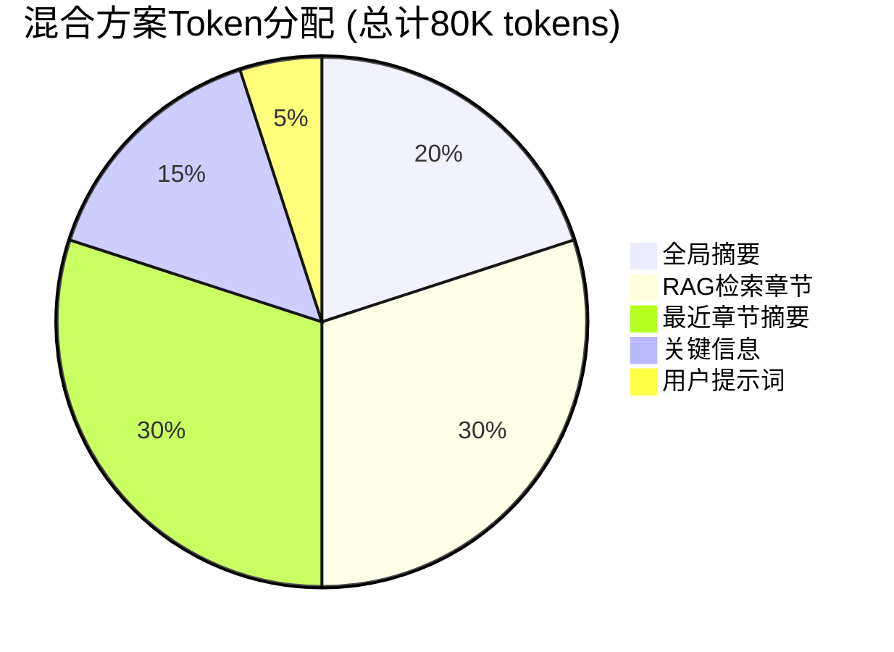

# 摘要提取流程图

## 1. 首次导入流程图

```mermaid
graph TD
    A[上传txt小说] --> B[LLM识别章节]
    B --> C{章节内容<br/>是否超过<br/>上下文限制?}
    
    C -->|是| D[分段处理章节]
    C -->|否| E[直接生成章节摘要]
    
    D --> F[提取段落要点]
    F --> G[合并为章节摘要]
    G --> H[保存章节摘要]
    
    E --> H
    
    H --> I{是否所有<br/>章节处理完?}
    I -->|否| C
    I -->|是| J[提取关键信息<br/>人物/地点/设定]
    
    J --> K{章节摘要总数<br/>是否超过<br/>上下文限制?}
    
    K -->|否| L[直接生成全局摘要]
    K -->|是| M[使用关键章节提取法]
    
    M --> N[选择最近N章<br/>+ embedding检索相关章节<br/>+ 人物关键章节]
    N --> L
    
    L --> O[保存全局摘要]
    O --> P[保存关键信息元数据]
    P --> Q[完成]
```

## 2. 增量更新流程图（新增章节后）

```mermaid
graph TD
    A[新增/修改章节] --> B[生成章节摘要]
    B --> C[保存章节摘要]
    
    C --> D[更新全局摘要的<br/>最近章节滑动窗口]
    D --> E{新章节是否<br/>属于某个卷?}
    
    E -->|是| F[更新卷摘要]
    E -->|否| G[标记全局摘要<br/>需要手动更新]
    F --> G
    G --> H[完成<br/>等待手动触发全局更新]
```

## 3. 手动触发全局摘要更新流程

```mermaid
graph TD
    A[用户触发全局摘要更新] --> B[获取当前全局摘要]
    B --> C[获取所有章节摘要]
    
    C --> D{章节摘要总量<br/>是否在上下文内?}
    
    D -->|是| E[直接生成新全局摘要]
    D -->|否| F[关键章节提取]
    
    F --> G[选择最近N章<br/>必选]
    G --> H[Embedding检索<br/>与主题相关的章节]
    H --> I[提取人物关键章节]
    
    I --> J[合并关键章节摘要]
    J --> K[结合当前全局摘要<br/>生成增量更新]
    
    E --> L[更新全局摘要]
    K --> L
    L --> M[更新关键信息元数据]
    M --> N[完成]
```

## 4. 续写时的上下文组装流程（摘要方案）

```mermaid
graph TD
    A[用户输入续写提示词] --> B[选择续写策略]
    
    B --> C{策略类型}
    
    C -->|摘要方案| D[获取全局摘要]
    C -->|RAG方案| E[Embedding检索相关章节]
    C -->|混合方案| F[获取全局摘要<br/>+ RAG检索章节]
    
    D --> G[获取最近N章摘要]
    E --> H[提取相关章节摘要/段落]
    F --> I[获取最近N章摘要<br/>+ RAG检索章节]
    
    G --> J[获取关键信息<br/>人物/设定/时间线]
    H --> J
    I --> J
    
    J --> K[计算各部分的token分配]
    K --> L{总token是否<br/>超过限制?}
    
    L -->|是| M[压缩各部分<br/>优先保留关键信息]
    L -->|否| N[组装最终上下文]
    
    M --> N
    N --> O[调用LLM进行续写]
    O --> P[保存续写结果]
```

## 5. 数据流架构

```mermaid
graph LR
    A[原始小说文本] --> B[章节分块]
    B --> C[章节摘要]
    
    C --> D[卷摘要<br/>可选]
    C --> E[全局摘要]
    
    C --> F[关键信息提取]
    F --> G[人物信息]
    F --> H[地点信息]
    F --> I[世界观设定]
    
    C --> J[向量化Embedding]
    
    E --> K[续写上下文组装]
    G --> K
    H --> K
    I --> K
    J --> L[RAG检索]
    L --> K
    
    K --> M[LLM续写]
```

## 6. 存储层次结构

```mermaid
graph TD
    A[Novel<br/>小说] --> B[Chapter<br/>章节<br/>包含: 原始文本<br/>章节摘要]
    
    A --> C[Summary<br/>摘要<br/>类型: CHAPTER/VOLUME/GLOBAL]
    
    A --> D[NovelMetadata<br/>关键信息<br/>人物/地点/设定]
    
    B --> E[Embedding<br/>向量<br/>用于RAG检索]
    
    style A fill:#e1f5ff
    style B fill:#fff4e1
    style C fill:#e8f5e9
    style D fill:#f3e5f5
    style E fill:#fce4ec
```

## 7. Token分配策略（以100K模型为例）

```mermaid
pie title 摘要方案Token分配 (总计80K tokens)
    "全局摘要" : 24000
    "最近章节摘要" : 32000
    "关键信息" : 16000
    "用户提示词" : 8000
```

```mermaid
pie title 混合方案Token分配 (总计80K tokens)
    "全局摘要" : 16000
    "RAG检索章节" : 24000
    "最近章节摘要" : 24000
    "关键信息" : 12000
    "用户提示词" : 4000
```

